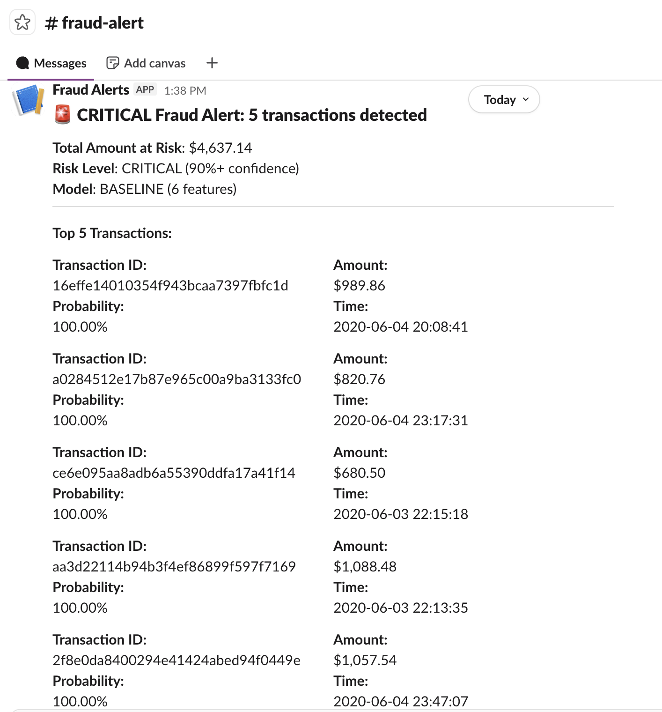

# Fraud Detection Pipeline

An end-to-end ML pipeline for detecting fraudulent credit card transactions using Snowflake, dbt, and Python.

## Project Context

End-to-end ML pipeline for detecting fraudulent credit card transactions. This project demonstrates:
- Complete data pipeline from raw data to predictions
- Modern data stack implementation (Snowflake, dbt, Python)
- ML workflow using Snowflake Cortex
- Automated alerting system

## What This Pipeline Does

1. Loads 1.3M transaction records from Kaggle into Snowflake
2. Engineers 15 features using dbt (amount patterns, velocity, time, location)
3. Trains a classification model using Snowflake Cortex ML
4. Scores transactions and assigns risk levels
5. Sends Slack alerts for high-risk transactions

## Architecture

```
Kaggle Dataset (CSV)
        ↓
Python Data Loader
        ↓
Snowflake RAW Layer
        ↓
dbt Transformations
  - stg_transactions (clean data)
  - int_features (15 engineered features)
  - fct_fraud_features (final feature table)
        ↓
Snowflake Cortex ML
  - Train classifier
  - Generate predictions
        ↓
fct_fraud_predictions (scored transactions)
        ↓
Python Alert Script → Slack
```

## Tech Stack

- **Data Warehouse**: Snowflake
- **Transformation**: dbt
- **Language**: Python 3.10+
- **ML**: Snowflake Cortex ML
- **Alerting**: Slack webhooks
- **Testing**: pytest + dbt tests

## Dataset

Using the **Kaggle Credit Card Fraud Detection Dataset**:
- Source: https://www.kaggle.com/datasets/kartik2112/fraud-detection
- 1.3M transactions from 2019-2020
- ~0.17% fraud rate (imbalanced)
- Simulated data for education/research

## Features

### Phase 1 (10 features)
- **Amount**: transaction_amount, customer_avg_amount, amount_z_score
- **Velocity**: txns_last_24h, txns_last_7d, minutes_since_last_txn
- **Time**: hour_of_day, is_weekend
- **Customer**: customer_age, merchant_category

### Phase 2 (5 features)
- is_different_city
- is_new_max_amount
- merchant_fraud_rate
- is_late_night
- account_age_days

See `docs/FEATURE_NOTES.md` for rationale and implementation details.

## Quick Start

### 1. Prerequisites

- Python 3.10+
- Snowflake account (free trial works)
- Kaggle account
- Slack workspace (optional)

### 2. Installation

```bash
git clone <your-repo-url>
cd Fraud_detection_pipeline

python -m venv venv
source venv/bin/activate  # Windows: venv\Scripts\activate

pip install -r requirements.txt
```

### 3. Configuration

Set up Kaggle credentials:
```bash
mkdir -p ~/.kaggle
# Download kaggle.json from https://www.kaggle.com/settings/account
mv ~/Downloads/kaggle.json ~/.kaggle/
chmod 600 ~/.kaggle/kaggle.json
```

Set up environment variables:
```bash
cp .env.example .env
# Edit .env with your credentials
```

### 4. Initialize Snowflake

Run setup scripts in Snowflake console:
```sql
-- Execute sql/01_setup_snowflake.sql
-- Execute sql/02_setup_rbac.sql (optional)
```

### 5. Load Data

```bash
python scripts/load_data.py
```

Expected: ~1.3M rows loaded, fraud rate 0.17%

### 6. Run dbt Models

```bash
cd dbt_project
cp profiles.yml.example ~/.dbt/profiles.yml
# Edit ~/.dbt/profiles.yml if needed

dbt run
dbt test
```

### 7. Train Models (Iterative)

```bash
# Train baseline
# Execute ml/baseline_model.sql in Snowflake

# Train experiments
# Execute ml/experiments.sql in Snowflake

# Train full model
# Execute ml/train_model.sql in Snowflake

# Compare all models
python scripts/compare_models.py
```


### 8. Generate Predictions

```bash
# Execute ml/generate_predictions.sql in Snowflake
```

### 9. Evaluate Model

```bash
python scripts/evaluate_model.py
```

### 10. Send Alerts (Optional)

```bash
# Test mode
python scripts/slack_alert.py --dry-run

# Send actual alerts
python scripts/slack_alert.py
```

## Model Experiments & Performance

I trained 4 different models iteratively, adding features incrementally:

1. **Baseline** (6 features): Amount patterns + basic time
2. **With Velocity** (9 features): + transaction frequency metrics
3. **With Customer/Time** (13 features): + customer age, account age, time patterns
4. **Full Features** (15 features): + geography, merchant risk

### Results

After running all 4 experiments:

```
Model                     Features    Precision    Recall       F1        
--------------------------------------------------------------------------------
BASELINE                  6           82.9%        74.7%        78.6%     (best)
EXP2 (+ velocity)         9           75.5%        77.2%        76.3%
EXP3 (+ customer/time)    13          76.9%        80.2%        78.5%
FULL (all features)       18          74.2%        76.6%        75.4%

Best Model: BASELINE (6 features)
Why: Highest F1 score + simplest (least prone to overfitting)
```

**Key Finding**: More features didn't help! The baseline model with only 6 core features outperformed the complex models. This demonstrates:
- Simpler is often better (avoids overfitting)
- Feature selection matters more than quantity
- Not all engineered features add value


## Project Structure

```
fraud-detection-pipeline/
├── config/                          # Snowflake config templates
├── data/                            # Dataset location
│   ├── sample_transactions.csv      # Sample for inspection
│   └── DATA_DICTIONARY.md           # Dataset documentation
├── dbt_project/                     # dbt transformation layer
│   ├── models/
│   │   ├── staging/                 # Clean raw data
│   │   ├── intermediate/            # Feature engineering
│   │   └── marts/                   # Final tables
│   └── schema.yml                   # dbt tests
├── docs/                            # Documentation
│   ├── FEATURE_NOTES.md             # Feature engineering rationale
│   └── images/                      # Screenshots
├── ml/                              # ML training and scoring
│   ├── train_model.sql              # Cortex ML training
│   ├── generate_predictions.sql     # Score test set
│   └── evaluate_model.sql           # Performance queries
├── scripts/                         # Python utilities
│   ├── load_data.py                 # Kaggle → Snowflake loader
│   ├── slack_alert.py               # Alert system
│   ├── evaluate_model.py            # Model evaluation
│   ├── run_pipeline.py              # End-to-end orchestration
│   └── utils/                       # Shared utilities
├── sql/                             # Database setup
│   ├── 01_setup_snowflake.sql       # Create database/schemas
│   └── 02_setup_rbac.sql            # Role-based access
├── tests/                           # Python tests
└── requirements.txt                 # Dependencies
```

## Running the Full Pipeline

Automated execution:
```bash
python scripts/run_pipeline.py
```

This runs:
1. dbt transformations
2. Data quality checks
3. Prediction generation
4. Alert system

Can be scheduled with cron:
```bash
# Run daily at 6 AM
0 6 * * * cd /path/to/project && ./venv/bin/python scripts/run_pipeline.py
```

## Slack Alerts

The pipeline automatically alerts on CRITICAL risk transactions (90%+ fraud confidence).

### Example Alert



### How It Works

1. **Query high-risk transactions** from Snowflake
2. **Format alert message** with transaction details
3. **Send to Slack** via webhook
4. **Includes**: Transaction ID, amount, probability, timestamp

### Run Alert Script

```bash
# Preview what would be sent (no actual alert)
python scripts/slack_alert.py --limit 5 --dry-run

# Send actual alert for top 5 critical transactions
python scripts/slack_alert.py --limit 5
```

### Production Considerations

This demo uses batch processing on historical data. In production, you would:
- Integrate with streaming data (Kafka, Snowpipe)
- Trigger alerts in real-time as transactions occur
- Add rate limiting to prevent alert fatigue
- Include investigation links and action buttons

## Key Learnings

### What Worked
- **Iterative approach**: Starting simple and adding features incrementally
- **Temporal split**: Training on pre-Oct 2020, testing on Oct 2020+ for realistic evaluation
- **Feature comparison**: Actually measuring which features help vs hurt
- **Threshold tuning**: Testing multiple cutoffs to find best balance
- **dbt for features**: SQL is fast, readable, and testable

### Challenges
- **Class imbalance**: Only 0.17% fraud rate in dataset
- **Feature selection**: Researched common fraud patterns and tested systematically
- **Precision vs Recall**: Balanced trade-off between false alarms and missed fraud
- **Snowflake Cortex limits**: Managed ML service with less control than custom models

### What I'd Do Differently
- Test more time windows (6h, 48h, 30d) for velocity features
- Try feature importance analysis earlier to drop weak features
- Experiment with different date splits to validate stability
- Add cross-validation if not using Snowflake Cortex

## Limitations

This is a portfolio project, not production-ready. Known limitations:

1. **Batch processing only** - no real-time scoring
2. **No drift monitoring** - model performance could degrade over time
3. **Limited ML tuning** - using Cortex defaults
4. **Simulated data** - patterns may differ from real fraud
5. **No orchestration** - manual execution or basic scheduling
6. **Limited testing** - happy path focused


## Security Note

All credentials are stored in:
- `.env` file (git-ignored)
- Environment variables
- `config/*.yml` files (git-ignored)

Never commit:
- `.env`
- `config/snowflake_config.yml`
- `dbt_project/profiles.yml`
- Kaggle credentials

Use the `.example` template files instead.

## Testing

Run Python tests:
```bash
pytest tests/
```

Run dbt tests:
```bash
cd dbt_project
dbt test
```

## Documentation

- `docs/FEATURE_NOTES.md` - Feature engineering rationale and implementation
- Dataset: [Kaggle Credit Card Fraud Detection](https://www.kaggle.com/datasets/kartik2112/fraud-detection)

## Future Enhancements

Priority improvements for production:
1. Real-time scoring with Snowpipe and Tasks
2. Automated model retraining pipeline
3. Drift monitoring and alerting
4. Interactive fraud dashboard
5. Orchestration with Airflow/Prefect

## About

This project demonstrates end-to-end data pipeline development:
- Data engineering: Loading, transformation, quality checks
- ML workflow: Training, evaluation, prediction
- Automation: Alerts and monitoring
- Modern tools: Snowflake, dbt, Python

Built as a portfolio project to showcase data engineering capabilities.

## License

This project is for portfolio demonstration purposes. The underlying Kaggle dataset is licensed under CC0: Public Domain.

