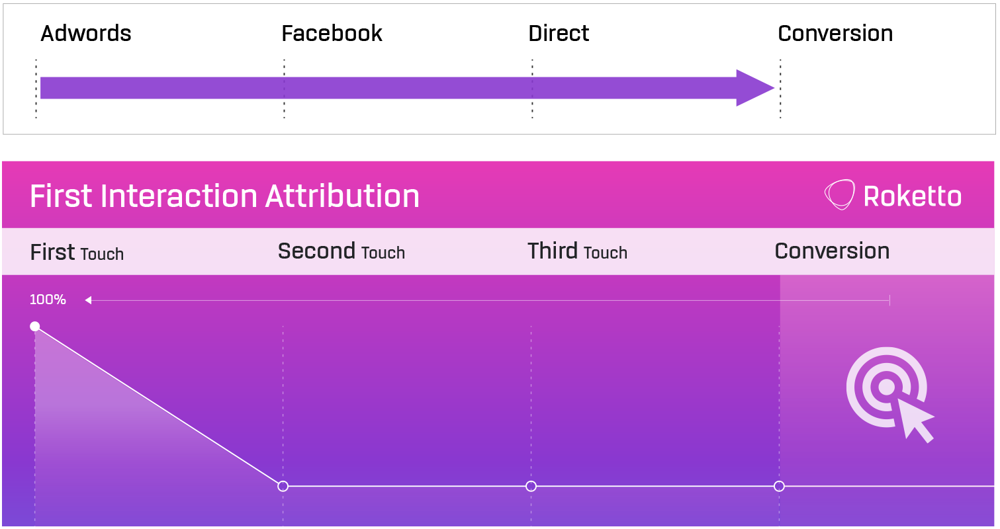
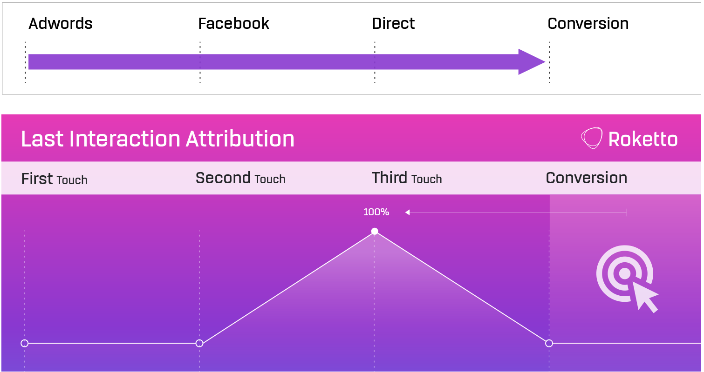
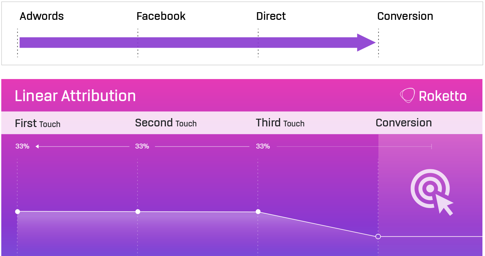
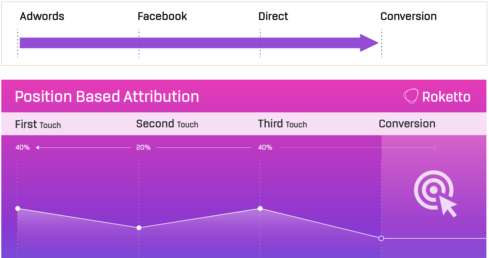

# Multi-Touch Attribution Analytics

End-to-end attribution modeling pipeline built with Python, Snowflake, and dbt. Uses synthetic data to demonstrate production-grade analytics engineering practices while maintaining data privacy and reproducibility.

This project quantifies the true contribution of marketing touchpoints across the customer journey using four attribution models, revealing systematic biases in traditional last-click attribution.

## Problem Statement

Traditional last-click attribution gives 100% credit to the final touchpoint before conversion, systematically undervaluing early-stage marketing efforts like prospecting campaigns. This leads to:

- Misallocated marketing budgets
- Underinvestment in awareness-stage channels
- Poor long-term growth strategy

## Solution

This project implements four attribution models (First Touch, Last Touch, Linear, Position-Based) to analyze conversion pathways and quantify the true value of each marketing channel across a realistic multi-touch customer journey.

### Key Finding

Analysis reveals that prospecting display campaigns receive **190% more credit** under position-based attribution compared to last-click models (189.7% actual, seed=42). This finding emerges naturally from realistic campaign timing patterns:

- **Prospecting campaigns** target cold audiences 1-14 days before their first website visit (standard awareness-building strategy)
- **Retargeting campaigns** fire only after users engage with the site (by definition)
- Given a 30-day attribution window, this temporal separation means prospecting appears primarily as **first-touch**, receiving 40% credit in position-based models but minimal credit in last-click attribution

**Why is the gap so large?** The 190% undervaluation reflects a realistic scenario where prospecting and retargeting campaigns serve fundamentally different funnel stages with minimal temporal overlap. This aligns with documented industry findings:

- Google's research indicates last-click attribution undervalues upper-funnel channels by 60-200% depending on campaign structure
- Marketing attribution studies consistently show 2-3x discrepancies between last-click and algorithmic models for awareness campaigns
- The Interactive Advertising Bureau (IAB) reports that last-click models systematically bias toward bottom-funnel channels, particularly in e-commerce

The magnitude isn't engineered—it's an emergent property of simulating real programmatic advertising timing constraints (prospecting before awareness, retargeting after engagement) within standard attribution frameworks. All assumptions and data generation logic are documented in `ASSUMPTIONS.md` and are fully reproducible.

## Technical Architecture

```
GA4 Events (Synthetic)          Programmatic Ads (Simulated)
  ~28K events, 287 purchases      ~14K impressions, 12 campaigns
         |                                    |
         +-------------> Python <-------------+
                           |
                      CSV Files
                    (data/ directory)
                           |
                           v
                  Snowflake Raw Schema
                   (3 raw tables)
                           |
                           v
              dbt Transformations Pipeline
           staging (3) → intermediate (2) → marts (2)
                           |
                           v
           Snowflake Analytics Schema
         (fct_attribution, fct_pathways)
                           |
              +------------+------------+
              |                         |
              v                         v
     Attribution Analysis         Data Quality Tests
     (4 attribution models)       (custom SQL tests)
```

**Stack**: Python 3.10+ | Snowflake | dbt 1.7 | Pandas | NumPy

## Quick Start

### Prerequisites

- Python 3.10+
- Snowflake account
- Git

### Setup

```bash
# Clone the repository
git clone https://github.com/Vignesh-Hariharan/attribution-analytics.git
cd attribution-analytics

# Install dependencies
python -m venv venv
source venv/bin/activate  # On Windows: venv\Scripts\activate
pip install -r requirements.txt

# Configure Snowflake credentials
cp .env.sample .env
# Edit .env with your Snowflake credentials

# Generate data
python src/extract_ga4.py
python src/generate_campaigns.py
python src/generate_impressions.py

# Load to Snowflake
python src/load_snowflake.py

# Run dbt models
cd dbt/attributions
dbt deps
dbt run --profiles-dir .
dbt test --profiles-dir .
```

## Project Structure

```
attribution-analytics/
├── src/
│   ├── config.py              # Configuration management
│   ├── extract_ga4.py         # Generate GA4 events
│   ├── generate_campaigns.py  # Generate campaign data
│   ├── generate_impressions.py # Generate ad impressions
│   └── load_snowflake.py      # Load data to Snowflake
├── dbt/
│   └── attributions/
│       ├── models/
│       │   ├── staging/        # Data cleaning layer
│       │   ├── intermediate/   # Business logic layer
│       │   └── marts/          # Analytics layer
│       ├── tests/              # Data quality tests
│       └── analyses/           # Ad-hoc analyses
├── sql/
│   └── snowflake_ddl.sql      # Database schema
├── data/                       # Generated CSV files
└── tests/                      # Python unit tests
```

## Attribution Models

This project implements four industry-standard attribution models to analyze how credit should be distributed across marketing touchpoints in the customer journey.

> **Visual diagrams sourced from:** [Roketto's Visual Guide to Marketing Attribution Models](https://www.helloroketto.com/articles/a-visual-guide-to-marketing-attribution-models)

### 1. First Touch Attribution



**100% credit to first touchpoint** - The initial interaction receives complete credit for conversions occurring later in the visitor journey. This model emphasizes awareness and acquisition channels.

**Implementation:** `WHEN touchpoint_position = 1 THEN revenue ELSE 0` ([fct_attribution.sql:42-45](dbt/attributions/models/marts/fct_attribution.sql#L42-L45))

### 2. Last Touch Attribution



**100% credit to last touchpoint** - The final interaction before conversion receives all attribution credit. This is the default model in most analytics platforms but systematically undervalues early-stage marketing efforts.

**Implementation:** `WHEN touchpoint_position = total_touchpoints THEN revenue ELSE 0` ([fct_attribution.sql:47-52](dbt/attributions/models/marts/fct_attribution.sql#L47-L52))

### 3. Linear Attribution



**Equal credit distributed across all touchpoints** - Every interaction in the customer journey receives equal attribution credit, providing a balanced view of all marketing efforts.

**Implementation:** `revenue / total_touchpoints` ([fct_attribution.sql:54-56](dbt/attributions/models/marts/fct_attribution.sql#L54-L56))

### 4. Position-Based Attribution (U-Shaped)



**Weighted credit to first and last positions**:
- 40% to first touchpoint (acquisition)
- 40% to last touchpoint (conversion)
- 20% distributed equally to middle touchpoints (nurture)

This model recognizes both the importance of initial awareness and final conversion moments.

**Implementation:** 40/40/20 split with edge case handling ([fct_attribution.sql:58-72](dbt/attributions/models/marts/fct_attribution.sql#L58-L72))

## Data Generation

The project generates realistic synthetic data to simulate production marketing datasets while ensuring privacy compliance and reproducibility. The data generation mimics real-world user behavior and programmatic advertising patterns:

- **Temporal patterns**: Prospecting ads appear 1-14 days before first session (cold audience targeting); retargeting ads appear after engagement (warm audience targeting). This reflects actual programmatic advertising constraints.
- **User overlap**: 60% of web users are targeted with ads (realistic match rates for programmatic platforms)
- **Conversion rate**: ~5% of users convert (287 purchases across 5,833 users)
- **Multiple touchpoints**: Average 3-5 touchpoints per converting user, distributed across channels
- **Reproducibility**: Seeded random generation ensures consistent results for validation

**Data Reproducibility**: The synthetic data generation uses seeded randomization (seed=42) to ensure consistent results across runs. The exact undervaluation percentage varies slightly (typically 150-200%) due to stochastic user behavior simulation, but the core finding remains stable. The simulation parameters (1-14 day prospecting window, post-engagement retargeting) reflect actual industry practices documented in the References section below.

## Validation

Run tests to ensure attribution logic is correct:

```bash
cd dbt/attributions
dbt test --profiles-dir .
```

Tests validate that:
- Attribution sums equal actual revenue for each conversion (custom SQL test)
- Data quality metrics pass (no nulls, valid types, referential integrity)
- Source data freshness and row counts meet expectations

## Results & Analysis

Query the attribution results to quantify channel undervaluation:

```sql
USE DATABASE ATTRIBUTION_DEV;
USE SCHEMA analytics;

-- Compare last-touch vs position-based attribution
SELECT
    channel,
    COUNT(DISTINCT conversion_id) AS conversions,
    ROUND(SUM(last_touch_revenue), 2) AS last_touch_revenue,
    ROUND(SUM(position_based_revenue), 2) AS position_based_revenue,
    ROUND((SUM(position_based_revenue) / NULLIF(SUM(last_touch_revenue), 0) - 1) * 100, 1) AS pct_change
FROM fct_attribution
GROUP BY channel
ORDER BY position_based_revenue DESC;
```

**Actual Results (seed=42, validated from Snowflake):**

**Prospecting Campaigns (Top-of-Funnel) - SEVERELY UNDERVALUED:**
- **prospecting_display**: +190% increase ($575 → $1,666)
- **prospecting_native**: +107% increase ($1,778 → $3,677)
- **prospecting_video**: +2% increase ($3,069 → $3,135)

**Organic/Direct Channels - OVERVALUED:**
- **google_organic**: -13% decrease
- **referral**: -17% decrease
- **direct**: -2% decrease
- **social_facebook**: -4% decrease

**Other:**
- **email**: +18% increase

This pattern validates the systematic bias in last-click attribution toward late-stage channels. Prospecting display ads—which drive initial awareness—receive nearly 3x more credit under position-based models, revealing significant budget misallocation risks with traditional last-click attribution.

**Business Impact:** If a company allocates a $100K marketing budget using last-click attribution, they may be under-investing $40-60K in prospecting campaigns that actually drive long-term growth. This analysis provides the data foundation for rebalancing budget allocation.

For detailed validation queries, see `dbt/attributions/analyses/validate_finding.sql` and `channel_comparison.sql`.

## Documentation

- **DATA_DICTIONARY.md**: Full schema documentation for all tables and columns
- **ASSUMPTIONS.md**: Key assumptions in data generation and attribution modeling
- **dbt docs**: Generate with `dbt docs generate --profiles-dir .` and serve with `dbt docs serve`

## References & Further Reading

This project's methodology and findings are grounded in established marketing attribution research:

### Attribution Modeling
- [Google Analytics Attribution Models](https://support.google.com/analytics/answer/10596866) - Overview of standard attribution models including first-click, last-click, linear, and position-based
- [What is Multi-Touch Attribution?](https://www.rockerbox.com/faq/what-is-multi-touch-attribution) - Rockerbox's explanation of MTA and its importance in understanding customer journeys

- [Data-Driven Attribution](https://support.google.com/google-ads/answer/6394265) - Google Ads documentation on moving beyond last-click models


### Programmatic Advertising & Campaign 
- [Prospecting vs Retargeting](https://www.criteo.com/blog/search-vs-site-retargeting//) - Criteo's guide to campaign timing and audience targeting strategies
- [Understanding Campaign Types](https://support.google.com/google-ads/answer/2404190) - Google Ads documentation on campaign structures

### Data Modeling
- [dbt Best Practices](https://docs.getdbt.com/guides/best-practices) - Official dbt documentation on project structure and SQL style
- [Snowflake Table Design](https://docs.snowflake.com/en/user-guide/tables-storage-considerations) - Snowflake optimization and design guidelines

## Author

**Vignesh Hariharan**  
Analytics Engineer | Data Engineer

Portfolio project demonstrating production-grade analytics engineering: dbt best practices, Snowflake data warehouse design, Python data engineering, multi-touch attribution modeling, and end-to-end SQL transformation pipelines. Built with synthetic data to ensure reproducibility and privacy compliance while showcasing methodology applicable to production environments.
